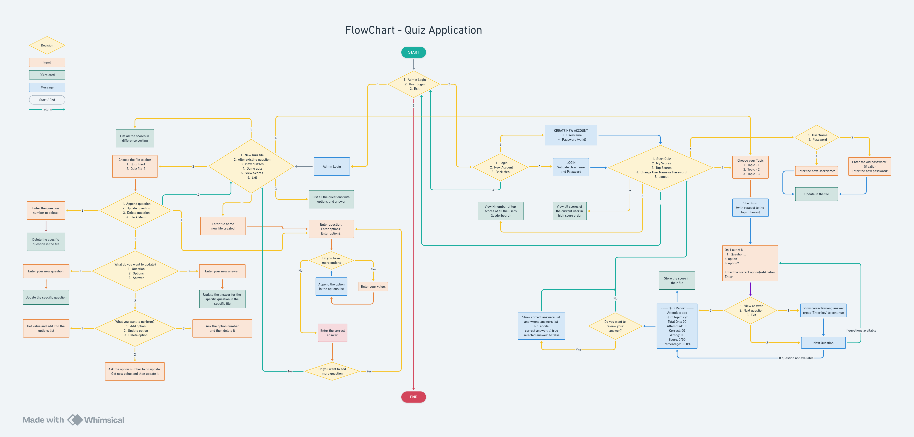

# Quiz Application 📝

A Java console-based quiz application with **User** and **Admin** roles.  
- **Users** can register, attempt quizzes, and track their scores.  
- **Admins** can manage quiz files, questions, and view scores in multiple ways.  

---

## 🚀 Features

### 👤 User
- Create a new account (register with username & password)  
- Login and attend available quizzes  
- View own score 
- Access the **leaderboard** (all users’ scores)  
- Update username and password  

### 🛠️ Admin
- Login with admin credentials  
- Create new quiz files  
- Alter existing quiz files (add, update, delete questions)
- View all available quiz files (all questions)  
- Conduct a **demo quiz** for testing  
- Access score reports:  
  - Sort by **username**  
  - Sort by **score**  
  - Sort by **date**  
  - Show **N top scores**  
- Can see total Users count
---

## 📊 Flowchart


---

## 🛠️ Tech Stack
- **Language:** Java (Core Java)  
- **Storage:** File Handling (to store quizzes, scores and user data)  

---

## ⚡ Getting Started

### Prerequisites
- Java 8 or higher installed  
- Any Java IDE (IntelliJ, Eclipse, NetBeans) or command-line setup  

### Run the Project
1. Clone or download the repository  
   ```bash
   git clone https://github.com/Vinu-AD/java-quiz-app.git
   cd java-quiz-app
   
2. Compile the project (start from App.java)
   ```bash
   javac App.java
   
3. Run the application
   ```bash
   java App
